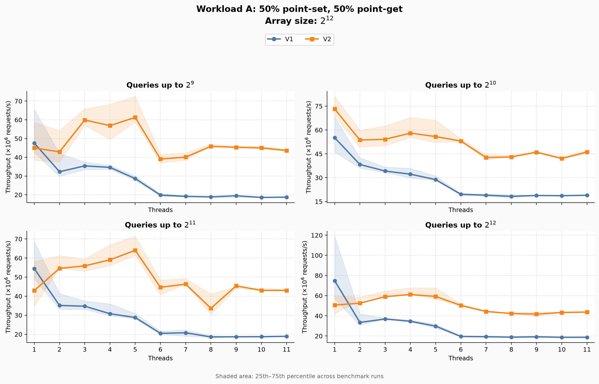
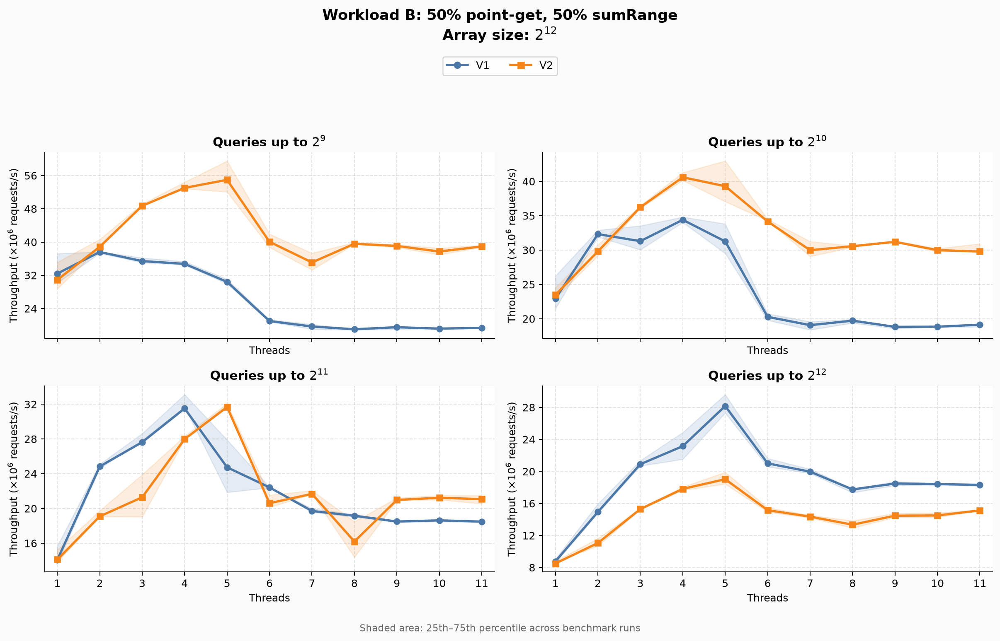
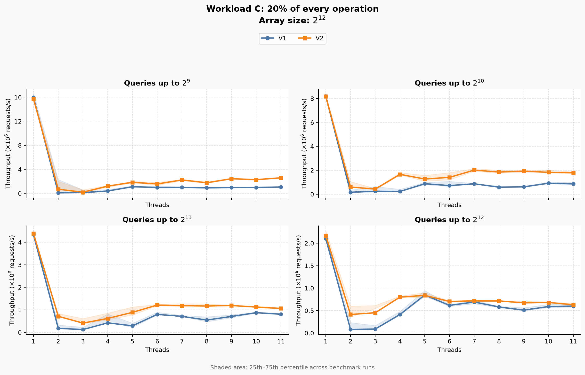
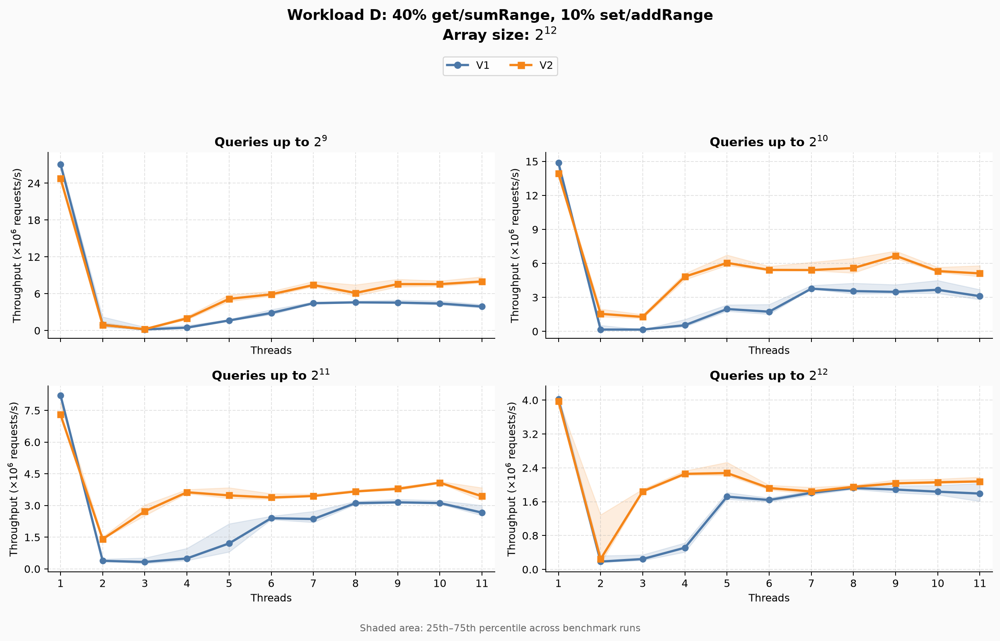
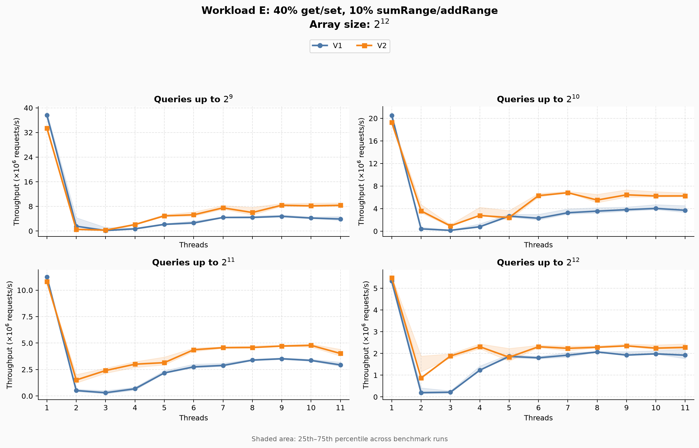
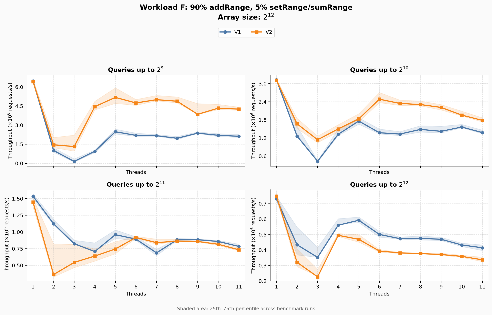
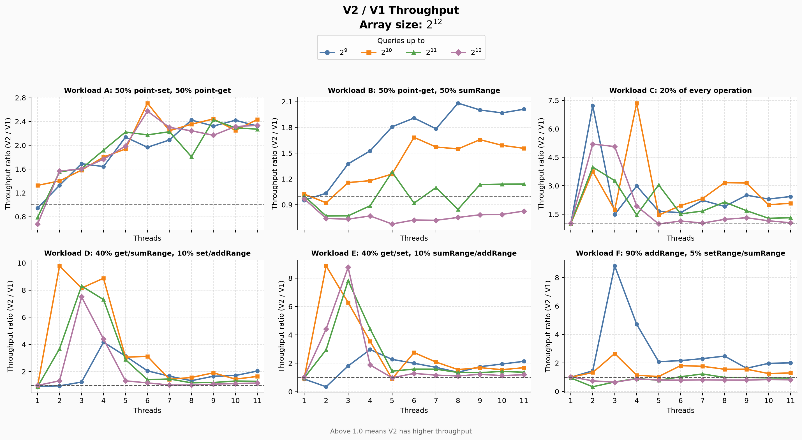

# Benchmark Results

## Workload A: 50% point-set, 50% point-get

## Workload B: 50% point-get, 50% sumRange

## Workload C: 20% of every operation

## Workload D: 40% get/sumRange, 10% set/addRange

## Workload E: 40% get/set, 10% sumRange/addRange

## Workload F: 90% addRange, 5% setRange/sumRange

## V2 / V1 Throughput

