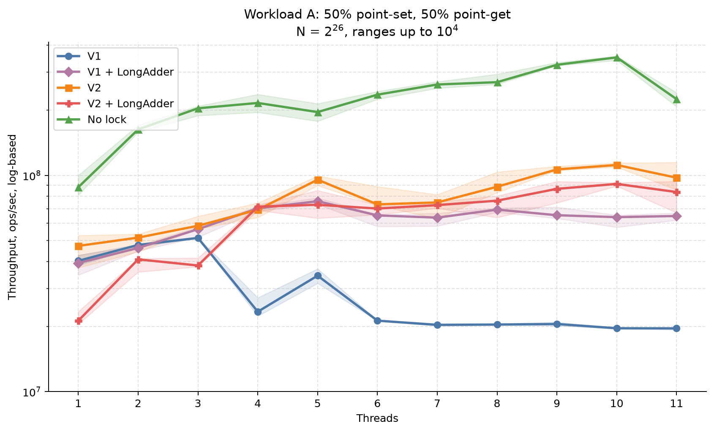
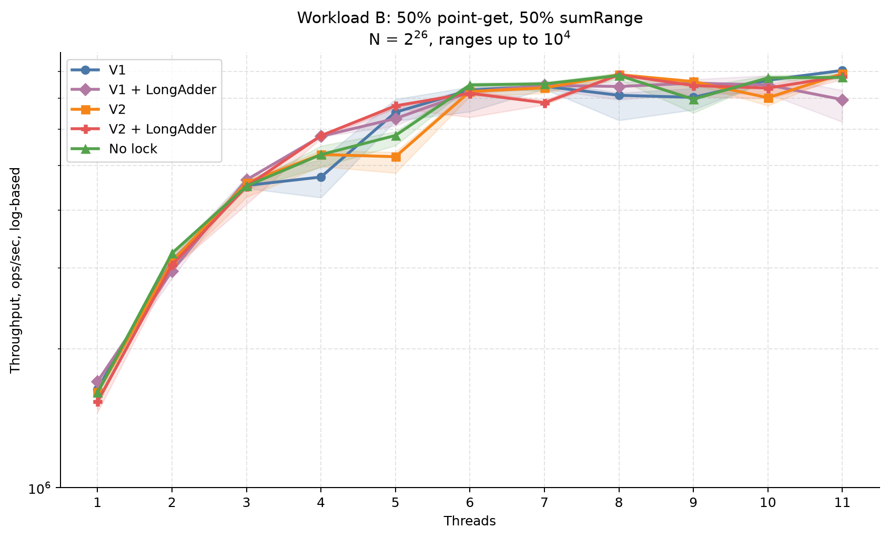
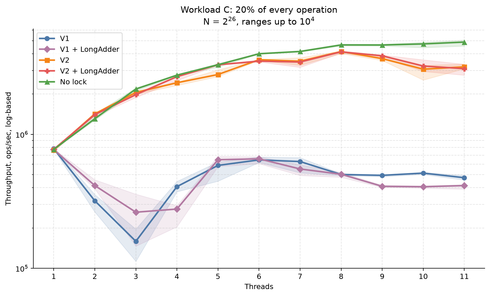
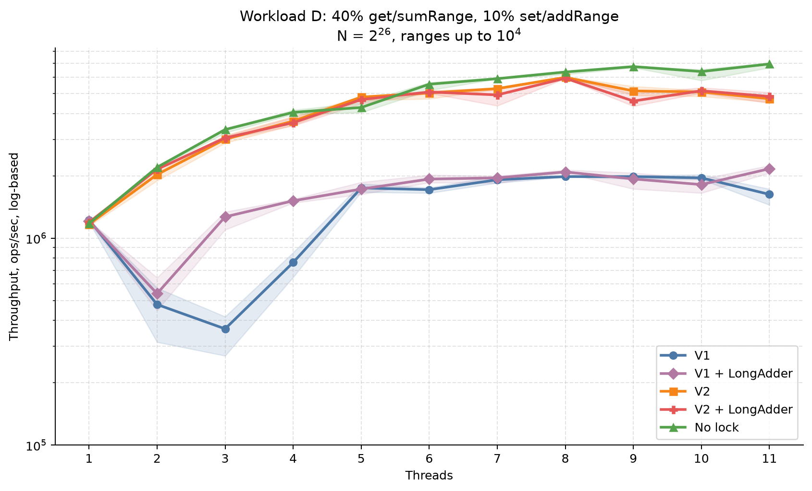
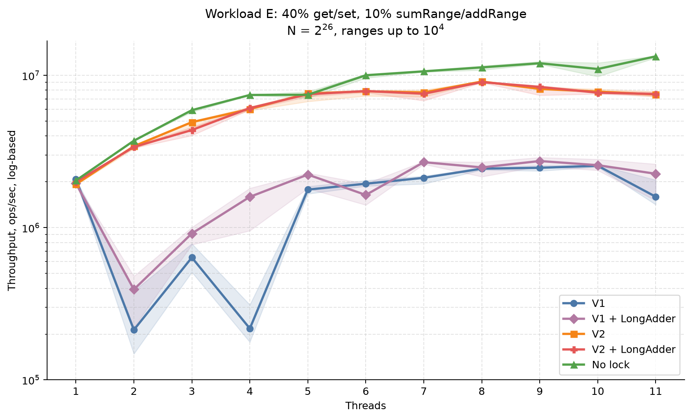
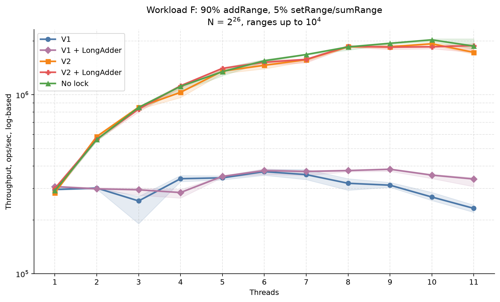
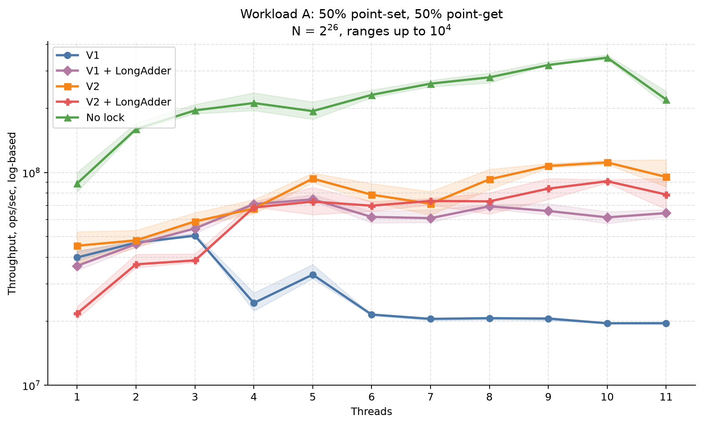
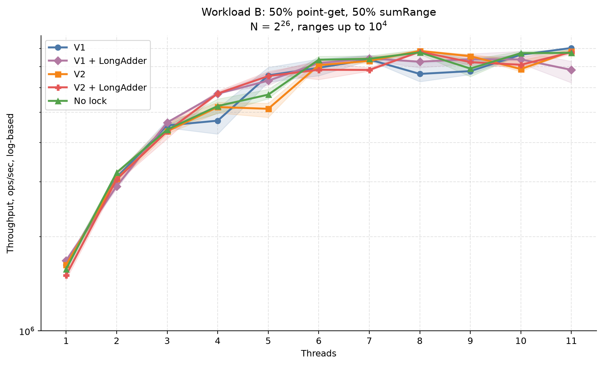
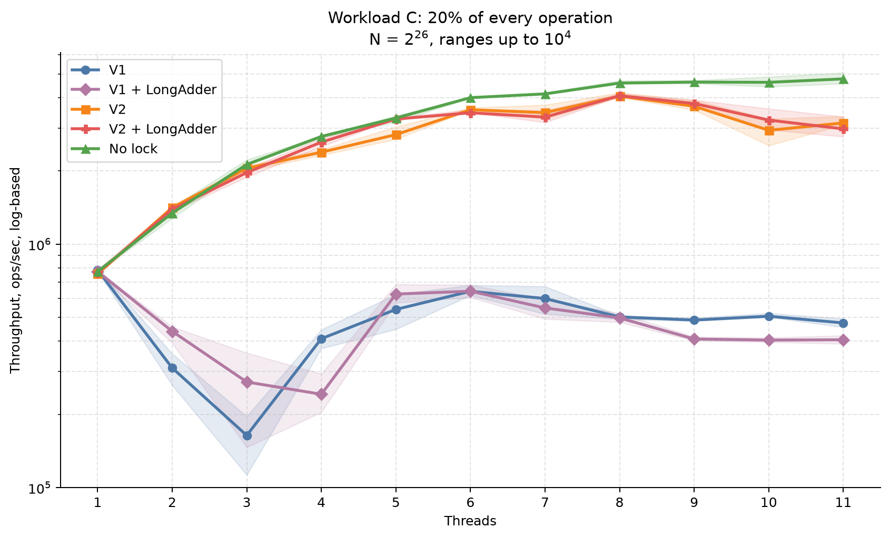
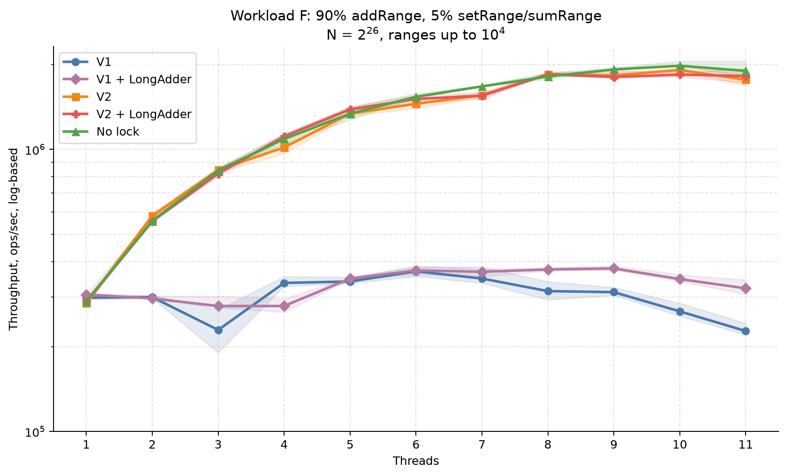

# Benchmark Results

Each point contains 20 benchmark iterations. The shaded area is the 25th–75th percentile interval.
The center line is the median below and the arithmetic mean in the second section.
The effective configuration is saved in [config.json](config.json).

## Median throughput

### Workload A: 50% point-set, 50% point-get

### Workload B: 50% point-get, 50% sumRange

### Workload C: 20% of every operation

### Workload D: 40% get/sumRange, 10% set/addRange

### Workload E: 40% get/set, 10% sumRange/addRange

### Workload F: 90% addRange, 5% setRange/sumRange

## Mean throughput

### Workload A: 50% point-set, 50% point-get

### Workload B: 50% point-get, 50% sumRange

### Workload C: 20% of every operation

### Workload D: 40% get/sumRange, 10% set/addRange

### Workload E: 40% get/set, 10% sumRange/addRange

### Workload F: 90% addRange, 5% setRange/sumRange

